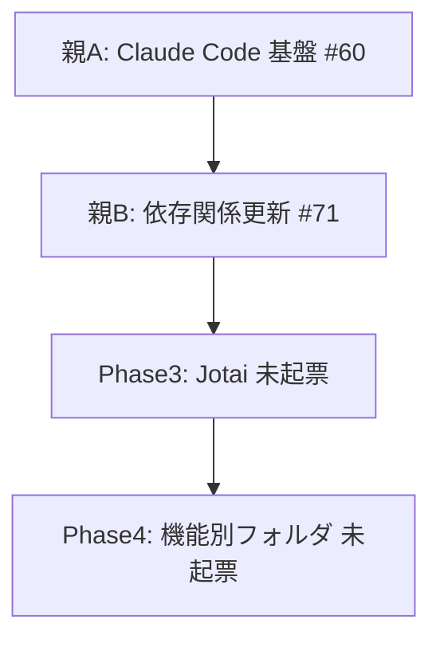

# LastMatorix リファクタリング ROADMAP

- 最終更新: 2026-05-04
- 正典: `issue-commit-guidelines.md` / `仕様書テンプレート.md` / `仕様書-Claude-Code活用基盤整備.md`

## サマリ

本プロジェクトのリファクタリングは **3 親 ISSUE + 2 未起票フェーズ** で構成される。
親 ISSUE 単位で進捗管理し、各サブ ISSUE は単独でマージ可能な「縦切り」で設計する。

| 親 / フェーズ | テーマ | 親 ISSUE | 状態 |
| --- | --- | --- | --- |
| 親A | Claude Code 活用基盤整備 | #60 | OPEN |
| 親B | 依存関係最新化 | #71 | OPEN |
| Phase3 | 状態管理導入 (Jotai) | — | 未起票 |
| Phase4 | 機能別フォルダ構成移行 | — | 未起票 |

## 推奨実施順

1. **親A** を独立サブから 3 並列で着手 — リファクタの安全網を先に張る
2. **親B** — 親A の品質ゲートと Biome/Vitest 土台が揃ってから
3. **Phase3** (Jotai) — 起票して着手
4. **Phase4** (機能別フォルダ) — Phase3 完了後

## 親A: Claude Code 活用基盤整備 (#60)

仕様書: `仕様書-Claude-Code活用基盤整備.md`

| ID | 内容 | ISSUE | 状態 | 触るファイル | 並列性 / 前提 |
| --- | --- | --- | --- | --- | --- |
| A-#1 | 規約自動適用 | #61 | OPEN ⚠️ | `CLAUDE.md`, `.claude/rules/*.md` | main 反映は #102 (廃止プロジェクト #99 のサブ) で対応 |
| A-#2 | 破壊操作ブロック | #62 | OPEN | `.claude/settings.json` (新規) | 独立。settings.json 共有: #63/#64/#67 より先に入れる |
| A-#3 | PostToolUse: 編集ごと lint/typecheck | #63 | OPEN | `.claude/settings.json` (hooks 追記) | 要 #62 + #83 (Biome) + typecheck script |
| A-#4 | Stop: 基本品質ゲート | #64 | OPEN | `.claude/hooks/`, `settings.json` (hooks) | 要 #63 |
| A-#5 | (品質ゲート親) | #65 | OPEN | — | サブを束ねる親 ISSUE |
| A-#5-1 | knip 導入と未使用 export 解消 | #68 | OPEN | `knip.json`, `package.json` | 独立 (親B 後推奨) |
| A-#5-2 | similarity-ts 導入と重複型解消 | #69 | OPEN | (CLI 設定 + 既存コード修正) | 独立 (親B 後推奨) |
| A-#5-3 | knip+similarity を Stop hook に統合 | #70 | OPEN | `.claude/hooks/` | 要 #64 + #68 + #69 |
| A-#6 | /commit skill | #66 | OPEN | `.claude/skills/commit/SKILL.md` | 完全独立 |
| A-#7 | context7 MCP | #67 | OPEN | `.mcp.json` (追記), `.claude/settings.json` | 要 #62 (settings.json 順序) |

### 着手順序

| ラウンド | 並列対象 | ファイル衝突 | 備考 |
| --- | --- | --- | --- |
| 第1 | **#66 + #82(β) + #62** | なし | A-#6 と β と A-#2 を 3 並列 |
| 第2 | #67 | #62 と settings.json 共有 | #62 完了後に追記 |
| 第3 | #83 → #84 | — | typecheck/lint/test の土台を整備 |
| 第4 | #63 → #64 | settings.json hooks 追記 | 第3完了後 |
| 第5 | #68 / #69 / #70 | — | 親B 完了後がベター (バージョンアップで未使用が変動) |

## 親B: 依存関係最新化 (#71)

| ID | 内容 | ISSUE | 状態 | 推奨順 |
| --- | --- | --- | --- | --- |
| B-#1 | Next.js 15 系最新マイナー追従 | #72 | OPEN | 2 |
| B-#2 | TypeScript 5.3.2 → 最新マイナー | #73 | OPEN | **1 (型推論強化を先に)** |
| B-#3 | MUI v5 → v7 (一気に) | #74 | OPEN | 5 |
| B-#4 | react-datepicker v4 → 最新 | #75 | OPEN | 6 |
| B-#5 | axios / dnd-kit / vitest 等の追従 | #76 | OPEN | 7 |
| B-#6 | Tailwind v3 → v4 (旧 #57 置換) | #77 | OPEN | 4 |
| B-#7 | ESLint v8 → v9 (旧 #56 置換) | #78 | OPEN | 3 |

仕様書 §「Phase 2」記載の通り、MUI は v6 を中継せず v5 → v7 に一気に上げる。

## 未起票フェーズ

| ローカル仕様書 | 起票方針 | 起票推奨タイミング |
| --- | --- | --- |
| `front/docs/Phase2/03_Storybook環境構築.md` | 旧 #54 がテンプレ未準拠のため、テンプレ準拠で書き直して起票 | 親B 完了後 |
| `front/docs/Phase2/04_サンプル実装.md` | 旧 #55 と統合して整理、Storybook ストーリー込み | 親B 完了後 |
| `front/docs/Phase3_状態管理導入.md` | `/design-issues` で親 + サブに縦切り分解 (Jotai 導入 / TaskList リファクタ / リアルタイム同期) | 親B 完了後 |
| `front/docs/Phase4_機能別フォルダ構成移行.md` | `/design-issues` で親 + サブに縦切り分解 (TaskCard / AddTask / MatrixArea / auth ごと) | Phase3 完了後 |

## 旧 ISSUE の扱い

| 番号 | タイトル | 扱い |
| --- | --- | --- |
| #57 | [機能] Tailwindv3→v4 | **CLOSED ✅** (#77 で置換済) |
| #56 | [機能] ESLint移行完了 | **CLOSED ✅** (#78 で置換済) |
| #51 | [リファクタ] 開発環境刷新 | 親C で実質吸収 → **Close 候補** |
| #54 | [機能] storybook導入 | Phase2/03 を新起票後 Close |
| #55 | [機能] サンプル実装 | Phase2/04 を新起票後 Close |
| #19 | phaser3 の導入 | 別軸機能、現状維持 |
| #18 | スクレイピングで eシラバスから引っ張る試み | 別軸機能、現状維持 |
| #7 | ScarpingButton コンポーネント作成 | 別軸機能、現状維持 |

## 進行ルール

### ブランチ / コミット

- 1 ISSUE = 1 PR、ブランチ名は `feature/<番号>`、ベースは原則 `main`
- ISSUE 設計とコミット粒度は `issue-commit-guidelines.md` を正典に従う (1 PR ≦ 400 行 / 1 commit = 1 論理変更 / Conventional Commits)
- 縦切り原則: 各サブは単独でマージ・デプロイ・価値提供できる単位

### 並列性の判定

ファイル競合がないサブ ISSUE 同士は並列実装可能 (worktree 推奨)。

| 共有リソース | 該当 ISSUE | 競合管理 |
| --- | --- | --- |
| `.claude/settings.json` | #62, #63, #64, #67 | 順次実装 (推奨順 #62 → #67 → #63 → #64) |
| `.claude/hooks/*.sh` | #64, #70 | 順次 (#64 → #70) |
| `package.json` (devDeps) | #68, #69, 親B 系 (#72/#73/#74/#76 等) | 同時複数着手しない |
| `front/app/` (移行対象) | Phase4 全般 | 機能ブロック単位 (TaskCard / AddTask / MatrixArea / auth) で順次 |

### 仕様書とローカルドキュメントの対応

| ローカル文書 | 対応する施策 |
| --- | --- |
| `仕様書-Claude-Code活用基盤整備.md` | 親A 全体 (#60 + #61〜#70) |
| `front/docs/Phase1_Docker設定統一.md` | サブ #82 の補足 |
| `front/docs/Phase2_開発環境刷新.md`, `Phase2/01〜06` | #83/#84 + 親B #77/#78 の補足 |
| `front/docs/Phase3_状態管理導入.md` | Phase3 起票の元ネタ |
| `front/docs/Phase4_機能別フォルダ構成移行.md` | Phase4 起票の元ネタ |
| `front/docs/現状把握_LastMatorix.md` | 全フェーズの背景資料 |

## 更新履歴

- **2026-05-04** 初版作成。親A/B/C と Phase3/4 を整理。#61 が refront 上で実装済み (PR #79) で main 未反映であることを明記。
- **2026-05-04 (第2版)** §「refront ライフサイクル」節を新設し、**案 A「使命完遂後アーカイブ」** を採用方針として確定 (3 観点考察に基づく)。親C 表に C-6 (#93 = #61 main 反映) と C-7 (#94 = refront アーカイブ化) を追加。「親C スコープ外」節を削除し C-6 として親C に統合。
- **2026-05-04 (第3版)** refront ブランチ廃止 (#99) に伴い、§「refront ライフサイクル」節と §「親C: refront ブランチを main に反映」節、関連参照を除去。親A A-#1 の備考は #102 経由に更新。
